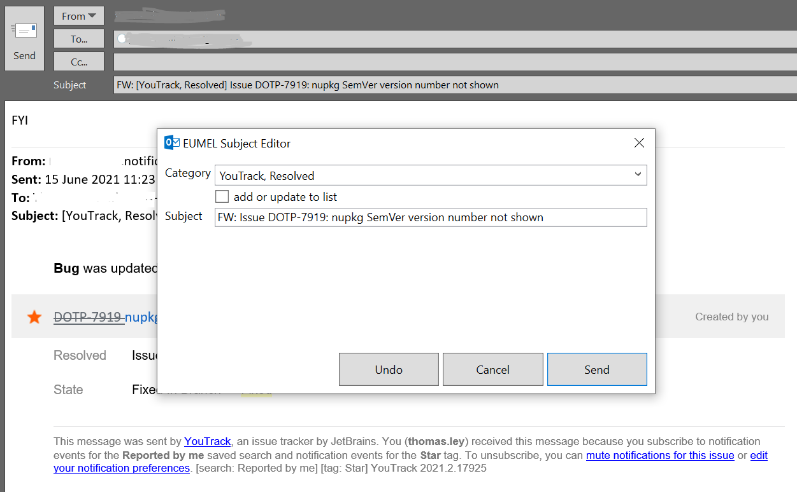

## EUMEL Suite

The EUMEL Suite provides several tools to manage files and emails. The following tools are planned, in a beta state, or implemented

* [x] Email Categorizer (Outlook Addin to add e.g. a project name to the email's subject)
* [ ] File and metadata storage
* [ ] Tools to work with files and file's metadata e.g. EXIF data in images or extended properties in Office documents

### Email Categorizer

This project is an addin for Microsoft Outlook.

The email categorizer is designed to add a project name to the email's subject. Project names are added to the subject with
opening and closing tags, e.g. "[" and "]" After sending an email, a dialogue is shown to select a project and see the parsed
subject. The dialogue shows the subject and the project, if a project is already set in the subject.

A so called outlook backstage view is added to configure the settings, storage backends and opening and closing tags. More details
see [Email Categorizer Details](pages/emailcategorizer.md)